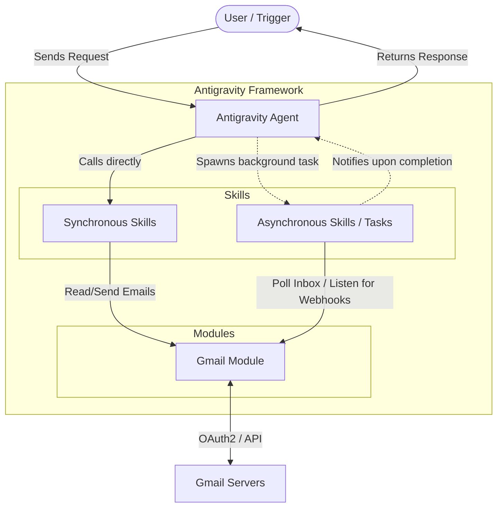

# Antigravity Agent Architecture

This document outlines the schema for an Antigravity Agent utilizing both synchronous and asynchronous skills, integrated with a Gmail module.

## Architecture Diagram

## Components

### 1. Antigravity Agent
* The core decision-maker that receives the user's intent, plans the execution, and invokes the appropriate skills.

### 2. Synchronous Skills (Synco)
* **Purpose:** Tasks that execute quickly and block the agent's context until completion.
* **Examples:** 
  * `read_recent_emails`: Fetches the last 5 emails.
  * `send_quick_reply`: Dispatches an email immediately.
  * `summarize_thread`: Uses the LLM to summarize an email thread.

### 3. Asynchronous Skills (Asynco)
* **Purpose:** Long-running tasks that operate in the background (via `run_command` as a daemon or `schedule` tools), allowing the agent to continue working or go to sleep until notified.
* **Examples:**
  * `watch_inbox`: A daemon that polls the Gmail API every 5 minutes and sends a high-priority message to the agent when a new urgent email arrives.
  * `process_large_attachments`: Downloads and analyzes massive files in the background without blocking the UI.

### 4. Gmail Module
* **Purpose:** The abstraction layer that handles authentication (OAuth2) and direct communication with the Google Workspace APIs.
* **Capabilities:** Handles token refresh, scopes (e.g., `https://www.googleapis.com/auth/gmail.modify`), and API rate limits.
