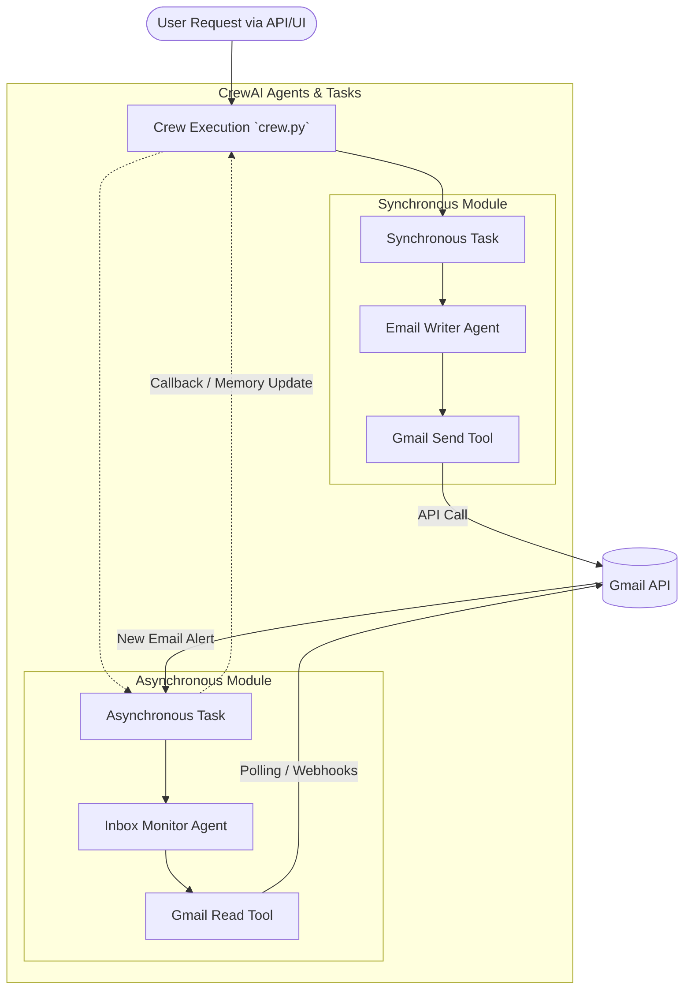

# CrewAI Gmail Agent Architecture

This schema outlines how to implement Synchronous (Sync) and Asynchronous (Async) CrewAI Agents and Tasks for Gmail integration within the `crewai_conversational_rag` project.

## Architecture Diagram



## Implementation Strategy for `crewai_conversational_rag`

### 1. The Gmail Tools (`tools.py`)
To support these agents, you need two types of tools interacting with the Google Workspace APIs (using `google-api-python-client` and OAuth2):
* **Sync Tools:** `send_email_tool`, `draft_email_tool`
* **Async Tools:** `fetch_new_emails_tool`, `search_inbox_tool`

### 2. The Synchronous Agent (`agents.py`)
**Role:** `Email Assistant`
* Runs synchronously during the user's request lifecycle.
* **Task:** The user says "Send an email to John about the meeting". The crew executes this task in real-time. The agent uses the `send_email_tool`, waits for the response, and replies "Email sent!" back to the user interface immediately.

### 3. The Asynchronous Agent (`agents.py` & `tasks.py`)
**Role:** `Inbox Monitor & Organizer`
* Runs in the background (using CrewAI's `async_execution=True` in the Task definition, or running inside a FastAPI background task).
* **Task:** The crew kicks off a background task that continuously monitors the inbox. When a new email arrives, the agent uses an LLM to categorize it, summarize it, and update the internal database (`users.db` or ChromaDB) without forcing the user to wait for it to finish.

### 4. Integration with `crew.py`
```python
from crewai import Task, Crew

# Synchronous Task (Blocks until done)
write_email_task = Task(
    description="Draft and send a reply to the latest client email.",
    agent=email_writer_agent,
    async_execution=False
)

# Asynchronous Task (Runs in background)
monitor_inbox_task = Task(
    description="Monitor the inbox for the next 1 hour, categorize new emails, and save summaries.",
    agent=inbox_monitor_agent,
    async_execution=True # <--- Key for Asynco module
)

# Crew Execution
gmail_crew = Crew(
    agents=[email_writer_agent, inbox_monitor_agent],
    tasks=[write_email_task, monitor_inbox_task]
)
```
